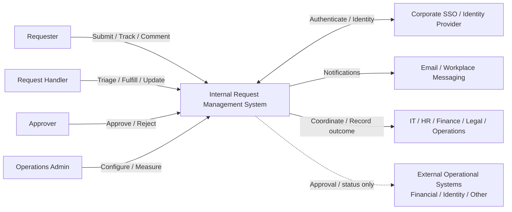
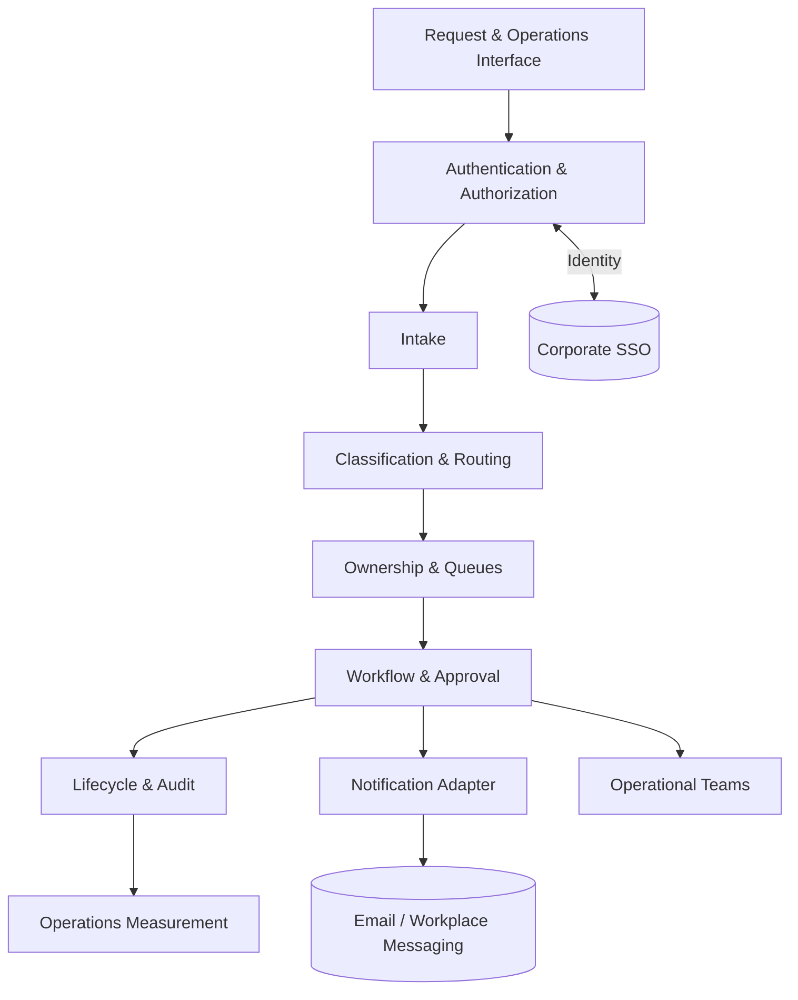
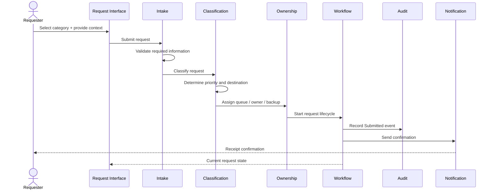
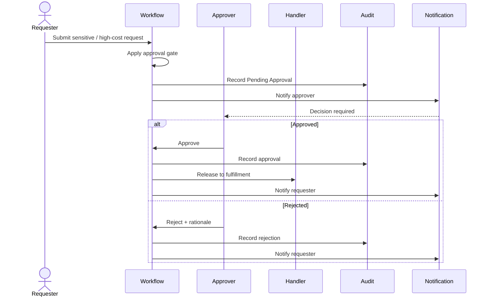

# Internal Request Management System — Architecture

> **Scope:** High-level architectural map for the system described in `product-spec.md`.
>
> **Source of truth:** `product-spec.md`. This document defines stable system boundaries, responsibilities, flows, trust boundaries, and architectural decisions; it intentionally avoids implementation details.

## 1. Purpose + Scope

The Internal Request Management System is the company's single **front door** for internal operational requests.

Every request follows:

**Intake → Classification → Ownership → Workflow → Measurement**

### Requirements driving the design

The architecture is driven by the product requirements that matter most to the system shape:

- **Unified Front Door** — all internal operational requests enter through one system.
- **Minimalist Dynamic Forms** — collect enough context for routing and triage without form bloat.
- **Rule-Based Routing + Impact-Based Prioritization** — make ownership predictable and priority objective.
- **Explicit Ownership** — every request has a primary owner and backup.
- **Conditional Gating + Deterministic State Machine** — sensitive work requires approval and every request follows a controlled lifecycle.
- **Self-Service Status + Audit Logging** — users can see current state while important actions remain traceable.
- **Security, Data Privacy + Queue Health** — protect sensitive requests and provide operational visibility.

The architecture ensures that every request has:
- a structured entry point;
- enough information for routing and triage, without unnecessary form fields;
- an objective priority;
- an accountable owner;
- a deterministic lifecycle;
- appropriate authorization before sensitive work begins;
- visible status and blockage information;
- an auditable history; and
- measurable operational outcomes.

The system is a **workflow and tracking layer**. It does not replace corporate communication, financial processing, identity provisioning, or the operational teams that fulfill requests.

### Actors

- Requester
- Request Handler
- Approver
- Operations Admin

### System context

### Boundary

**Inside the system**
- Centralized request intake and dynamic forms
- Validation, classification, routing, and priority
- Ownership and queues
- Conditional approval workflow
- Request lifecycle and status visibility
- Comments and audit trail
- Queue and operational measurement
- Authorization enforcement

**Outside the system**
- Corporate SSO / identity provider
- Email and workplace messaging
- IT, HR, Finance, Legal, and Operations fulfillment work
- Financial systems that execute transactions
- Identity/access systems that provision permissions
- External customers and vendors
- Workplace chat as a replacement for the workflow system

## 2. Structure + Flow

The architecture is organized around seven major responsibilities: **Interface, Intake, Classification & Routing, Ownership & Queues, Workflow & Approval, Lifecycle & Audit, and Operations Measurement**. Notifications provide a supporting integration.

### Major components

| Component | Responsibility |
|---|---|
| **Request & Operations Interface** | Thin user-facing boundary for requesters, handlers, approvers, and administrators; supports submission, status, ownership, blockage reasons, comments, approvals, and authorized metrics. |
| **Intake** | Presents categories, renders category-specific required fields, validates submissions, and creates requests in `Submitted`. |
| **Classification & Routing** | Determines category, destination queue, owner/backup, and priority from business impact, urgency, risk, and SLA targets. Requester seniority does not determine priority. |
| **Ownership & Queues** | Maintains primary ownership, backup coverage, department queues, authorized reassignment, and requester-visible ownership. |
| **Workflow & Approval** | Enforces lifecycle transitions, applies approval gates, records explicit `Approve` / `Reject` decisions, and releases or declines gated requests. |
| **Lifecycle & Audit** | Records state transitions, reassignment, comments, approvals, actor, and timestamp information. |
| **Operations Measurement** | Measures volume, queue age, cycle time, SLA breaches, backlog, reopen rates, and dashboard freshness. |
| **Notification Adapter** | Sends confirmations and workflow notifications. Notifications are not the source of truth. |

### Core request flow

### Conditional approval flow

### External dependencies

| Dependency | Relationship | Architectural implication |
|---|---|---|
| **Corporate SSO / Identity Provider** | Authentication and identity | No weaker authentication fallback should be introduced. |
| **Email / Workplace Messaging** | Notification delivery | Notification failure must not invalidate authoritative request state. |
| **Operational Teams** | Actual fulfillment | The platform coordinates and tracks; teams perform the work. |
| **Financial Systems** | Actual financial transactions | The platform records routing/approval; it does not execute payments. |
| **Identity / Access Systems** | Actual permission provisioning | The platform records approval/workflow state; it does not directly provision access. |

## 3. Trust + Resilience

### Authentication and authorization

Authentication establishes **who** the user is; authorization establishes **what** that identity may access or change.

| Role | Permitted scope |
|---|---|
| **Requester** | Own submitted requests |
| **Handler** | Requests in the handler's assigned department queue |
| **Approver** | Requests specifically routed to that approver |
| **Administrator** | Global configuration; not unrestricted sensitive-request visibility |

Confidential HR, Legal, security-access, and other sensitive request information must remain isolated according to authorization scope. Administrator status does not automatically grant unrestricted access to sensitive payloads.

The workflow is also an authorization boundary: users cannot directly select arbitrary lifecycle states. A gated request remains `Pending Approval` until the required decision is recorded.

### Lifecycle

The request follows a deterministic lifecycle:

**Submitted → Pending Approval (when required) → In Progress → Blocked (when needed) → Resolved**

A request may instead move from `Pending Approval` to **`Declined`** when the required approval is rejected. Users cannot create arbitrary lifecycle states.

The workflow is the authoritative coordinator: approval decisions, fulfillment progress, blocking, and resolution are recorded in the request system rather than inferred from email or chat.

### Important failure scenarios

| Failure | Expected behavior |
|---|---|
| **SSO unavailable** | Do not introduce a weaker authentication bypass. Authentication-dependent access cannot proceed normally. |
| **Notification unavailable** | Keep workflow state authoritative; retry or deliver notifications later; users can inspect the request directly. |
| **Handler unavailable** | Keep the request visible and use configured backup coverage; ownership must not silently disappear. |
| **Approval dependency unavailable** | Keep the request `Pending Approval`; fulfillment remains blocked. Dependency failure is never approval. |
| **Fulfillment blocked** | Move to `Blocked`, record the reason, and expose it to the requester. |

### Scalability + reliability

The system is an internal operational platform, so the architecture favors **clarity and reliability over unnecessary distribution**.

- Form submissions, state updates, and queue transitions: **≤ 2 seconds** under normal operational load.
- Dashboard reflection after an underlying status change: **≤ 5 seconds**.
- Workflow state is authoritative.
- Notifications are secondary delivery mechanisms.
- Authorization is enforced at protected request boundaries.
- Audit lineage must survive ordinary dependency failures.
- Sensitive data follows least-privilege access.
- Scale complexity only where operational demand requires it.

The product specification does not define a required deployment topology or infrastructure scale, so this architecture does not prescribe one.

## 4. Architectural Decisions

### Communication decisions

- **In-system status is authoritative.** Email and workplace messaging notify users but do not own request status.
- **Notifications are decoupled from workflow state.** A notification failure must not invalidate a valid request transition; users can always inspect the authoritative request directly.

### Major decisions

| Decision | Why | Product requirement |
|---|---|---|
| **Centralized intake** | Prevent fragmented requests, lost work, and manual status chasing. | Unified Front Door |
| **Dynamic minimalist forms** | Collect enough context for routing and triage without form bloat. | Contextual Minimalist Forms |
| **Rule-based routing** | Make ownership and routing predictable. | Rule-Based Routing |
| **Objective priority** | Avoid seniority-based priority and use business impact, urgency, risk, and SLA targets. | Impact-Based Prioritization |
| **Explicit ownership** | Make accountability and backup coverage visible. | Ownership |
| **Conditional approval** | Protect sensitive/high-cost work without slowing routine requests. | Conditional Gating |
| **Central lifecycle** | Keep status consistent and measurable through a deterministic state machine. | Deterministic State Machine |
| **Audit trail** | Preserve accountability for meaningful actions. | Audit Logging / Audit Lineage |
| **RBAC + request-level authorization** | Protect sensitive requests and enforce least privilege. | Security & Access Control / Data Privacy |
| **Cohesive architecture** | Separate responsibilities without unnecessary microservices or distribution. | Product simplicity / narrow internal scope |

## 5. Traceability

This table closes the loop from the product specification to the architecture: each major requirement has a concrete architectural response.

| Product-spec requirement | Architectural response |
|---|---|
| Unified Front Door | Central request interface + Intake |
| Minimal required fields | Dynamic minimalist forms |
| Rule-Based Routing | Classification & Routing |
| Impact-Based Prioritization | Explicit priority rules |
| Primary + backup ownership | Ownership & Queues |
| Conditional Gating | Workflow & Approval |
| Deterministic State Machine | Controlled lifecycle |
| Self-Service Status Visibility | Authoritative request view |
| Explicit blockage reasons | `Blocked` state + visible reason |
| Audit Logging | Lifecycle & Audit |
| RBAC | Authentication + authorization boundary |
| Sensitive-data isolation | Least-privilege request access |
| Queue Health Dashboard | Operations Measurement |
| ≤ 2 second normal operations | Responsive workflow path |
| ≤ 5 second dashboard refresh | Measurement update path |
| No direct financial processing | Financial systems remain external |
| No automated identity provisioning | Identity systems remain external |
| No real-time chat infrastructure | Messaging remains a notification dependency |
| Internal-only scope | Customers/vendors remain outside the boundary |

> **Central principle:** Every request should have a clear entry point, an objective priority, an accountable owner, an authorized path, a visible state, and a reconstructable history.
