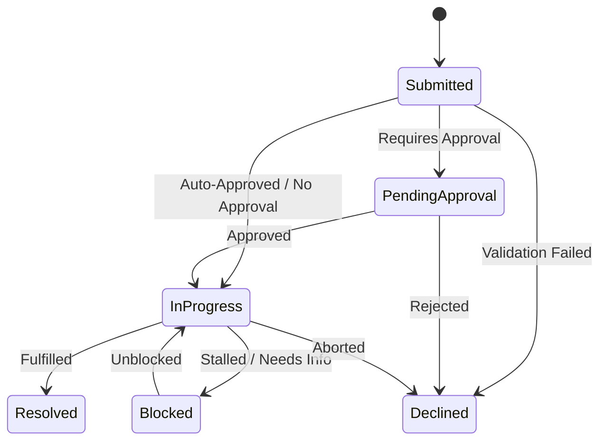

# **Internal Request Management System — Data Model**

## **1\. Domain**

### **1.1 Core Entities**

> * **User:** Represents individual system actors operating under designated roles (Requesters, Approvers, Queue Owners, System Administrators).  
> * **Request:** The primary entity capturing dynamic form payloads, category routing attributes, objective impact priorities, and system state.  
> * **Approval Step:** Represents a single required validation node within a request's approval workflow sequence.  
> * **Audit Entry:** An immutable record tracking state transitions, field modifications, system events, and user actions.  
> * **Queue / Department:** Organizational routing target that groups assigned requests and ownership teams.

### **1.2 Entity Relationships & Cardinality**

| Source Entity | Relationship | Target Entity | Cardinality | Description   |
| :---- | :---- | :---- | :---- | :---- |
| **User** | submits | **Request** | 1 : N | A single user can author multiple requests over time. |
| **Request** | requires | **Approval Step** | 1 : N | A request may trigger zero or multiple sequential/parallel approvals. |
| **Queue** | contains | **Request** | 1 : N | A queue manages multiple assigned incoming requests. |
| **User** | assigned to | **Request** | 0..1 : N | A request is assigned to at most one designated operational owner. |
| **Request** | generates | **Audit Entry** | 1 : N | Every state transition or update yields immutable historical log entries. |

### **1.3 Ownership & Data Boundaries**

> * **Request Ownership:** Created and authored by the Requester. Read access is restricted to the Requester, designated Approvers, Queue Owners, and System Admins.  
> * **Approval Ownership:** Managed authoritatively by the Workflow Engine and assigned Approvers.  
> * **Audit Entry Ownership:** Owned strictly by the system lifecycle engine; strictly read-only for all human actors.

## **2\. Lifecycle & Business Rules**

### **2.1 Deterministic State Machine**

The status lifecycle follows strict, unambiguous state transition pathways:  

### **2.2 State Transition Matrix**

| From State | To State | Trigger Event | Actor Requirement   |
| :---- | :---- | :---- | :---- |
| **Submitted** | Pending Approval | Approval rules triggered by intake routing. | System Workflow Engine |
| **Submitted** | In Progress | Auto-approval or no approval required. | System / Queue Owner |
| **Submitted** | Declined | Intake criteria validation failed or rejected. | System / Approver |
| **Pending Approval** | In Progress | All required approval steps granted. | System / Designated Approver |
| **Pending Approval** | Declined | Any required approval step rejected. | Designated Approver |
| **In Progress** | Blocked | Dependency stall or additional input required. | Assigned Owner |
| **Blocked** | In Progress | Dependency resolved or input received. | Assigned Owner / Requester |
| **In Progress** | Resolved | Operational fulfillment completed successfully. | Assigned Owner |
| **In Progress / Blocked** | Declined | Fulfillment aborted or deemed unfeasible. | Assigned Owner / Admin |

### **2.3 Invariants & Rules**

> * **Approval Invariant:** A request CANNOT enter In Progress if any pending approval steps remain unapproved.  
> * **Immutability Invariant:** Once a request reaches Resolved or Declined, core request payload attributes become strictly immutable.  
> * **Audit Invariant:** Every state transition MUST atomically create an Audit Entry capturing the actor ID, timestamp, prior state, and new state.  
> * **Authorization Boundary:** Non-admin Requesters can only query requests where they are explicitly set as requester\_id.

## **3\. Storage Strategy**

### **3.1 Storage Paradigm: Relational (PostgreSQL)**

A relational store is chosen to enforce ACID compliance for state machine transitions, guarantee referential integrity across users, requests, and approvals, and support structured index queries for active operational queues.

### **3.2 Durable vs. Derived Data**

| Data Classification | Entities / Fields | Persistence Rationale   |
| :---- | :---- | :---- |
| **Durable Data** | User, Request, Approval Step, Audit Entry, Queue | System-of-record state. Must persist reliably with transactional write safety. |
| **Derived Data** | Queue Depth Counter, SLA Time-to-Resolution Metrics, Aggregated Impact Priority Scores | Computed on-the-fly or aggregated asynchronously via audit log projections for dashboard reporting. |

## **4\. Access Patterns & Query Indexing**

### **4.1 Critical Product Access Patterns**

> * **Access Pattern 1 (Queue Dashboard):** Fetch all requests assigned to a specific Queue ID matching active statuses (In Progress, Pending Approval) ordered by priority and submission timestamp.  
> * **Access Pattern 2 (Requester History):** Fetch all requests submitted by a specific User ID ordered by creation date descending.  
> * **Access Pattern 3 (Audit Trail Retrieval):** Retrieve complete historical timeline entries for a given Request ID ordered sequentially by timestamp.  
> * **Access Pattern 4 (Pending Approvals Queue):** Retrieve all pending approval items where the current user is designated as the approver.

### **4.2 Indexing Strategy & Justifications**

| Target Table | Index Definition | Access Pattern Supported | Technical Justification   |
| :---- | :---- | :---- | :---- |
| requests | idx\_requests\_queue\_status\_priority (queue\_id, status, impact\_priority DESC, created\_at DESC) | Access Pattern 1 | Eliminates full table scans for high-frequency operational queue rendering and filtering. |
| requests | idx\_requests\_requester\_created (requester\_id, created\_at DESC) | Access Pattern 2 | Optimizes personal dashboard views for requesters listing their request history. |
| audit\_entries | idx\_audit\_request\_created (request\_id, created\_at ASC) | Access Pattern 3 | Ensures fast sequential log assembly when viewing request history details. |
| approval\_steps | idx\_approvals\_approver\_status (approver\_id, status) | Access Pattern 4 | Accelerates retrieval of actionable pending tasks for approvers. |

